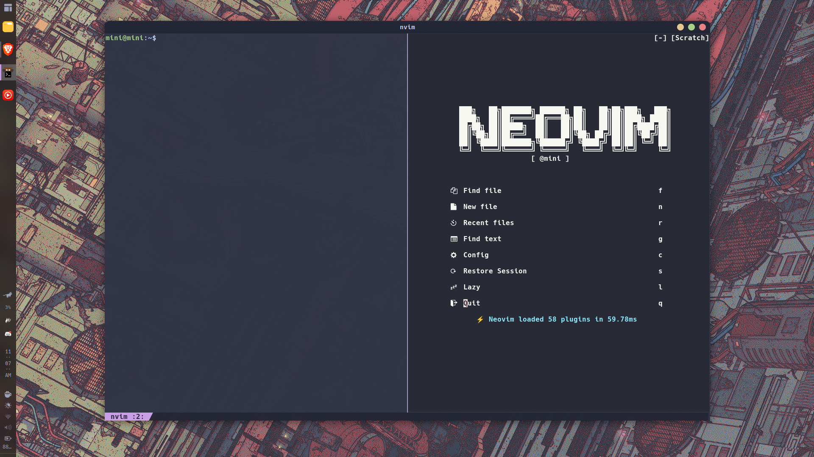
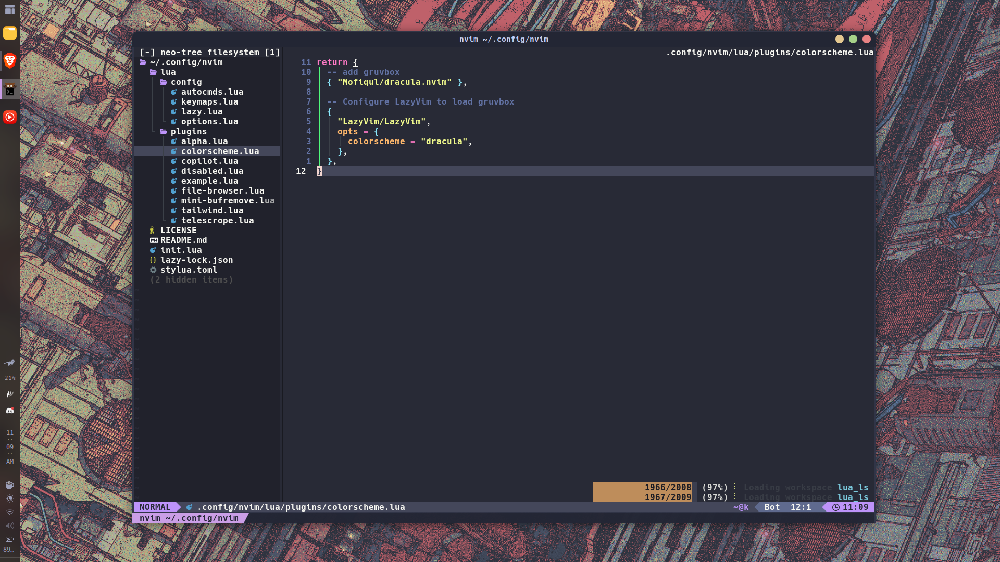

# Dotfiles

This repository consists of my dotfiles and extensions for my Fedora 38 and Ubuntu 22.04 setup.

## Preview

### Fedora 38

- Desktop preview
  

  _Not much config here since i like the default look of Fedora_

### Ubuntu 22.04

- Desktop preview
  

- Neovim + Kitty preview
  

- Neovim preview
  
